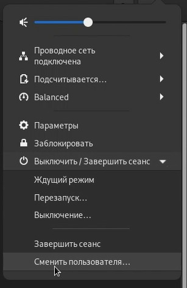
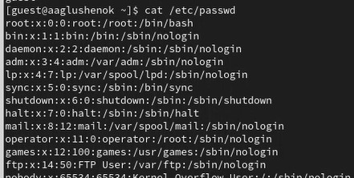
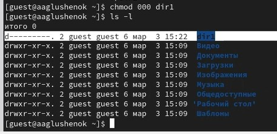
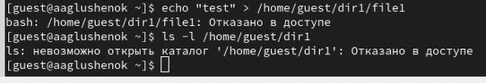

---
## Front matter
lang: ru-RU
title: Лабораторная работа № 2. Дискреционное разграничение прав в Linux. Основные атрибуты.
subtitle: Презентация
author:
  - Глушенок А. А.
institute:
  - Российский университет дружбы народов, Москва, Россия
date: 3 марта 2026

## Formatting pdf
toc: false
slide_level: 2
aspectratio: 169
section-titles: true
theme: metropolis
header-includes:
 - \metroset{progressbar=frametitle,sectionpage=progressbar,numbering=fraction}
 - \usepackage{graphicx}
 - \usepackage{caption}
 - \captionsetup{labelformat=empty, labelsep=none}
 
## Fonts
mainfont: Liberation Serif
sansfont: PT Sans
monofont: Liberation Mono
---

## Докладчик

:::::::::::::: {.columns align=center}
::: {.column width="70%"}

  * Глушенок Анна Александровна
  * Студент НПИбд-01-24
  * Факультет физико-математических и естественных наук
  * Российский университет дружбы народов
  * [1132246844@pfur.ru](mailto:1132246844@pfur.ru)
  * <https://github.com/aaglushenok>

:::
::: {.column width="30%"}

:::
::::::::::::::

## Цель работы

Получение практических навыков работы в консоли с атрибутами файлов, закрепление теоретических основ дискреционного разграничения доступа в современных системах с открытым кодом на базе ОС Linux.

## Задание 1-2

1. В ОС создайте учётную запись guest: `useradd guest`.
2. Задайте пароль для guest: `passwd guest`.

{width=40%}

## Задание 3

3. Войдите в систему от пользователя guest.

{width=25%}

## Задание 3

{width=40%}

## Задание 4-7

4. Определите директорию: `pwd`. Сравните с приглашением командной строки. Является ли она домашней директорией?
5. Уточните имя пользователя командой `whoami`.
6. Уточните имя пользователя, группу, группы куда входит пользователь: `id`. Сравните вывод `id` с `groups`.
7. Сравните информацию об имени пользователя с данными в приглашении командной строки.

{width=50%}

## Задание 8

8. Просмотрите файл /etc/passwd: `cat /etc/passwd`. Найдите свою учётную запись, определите uid, gid пользователя. Сравните со значениями в предыдущих пунктах.

{width=40%}

## Задание 8

{width=40%}

## Задание 9-10

9. Определите существующие в системе директории: `ls -l /home/`. Удалось ли получить список поддиректорий? Какие права установлены?
10. Проверьте, какие расширенные атрибуты установлены на поддиректориях /home: `lsattr /home`. Удалось ли увидеть атрибуты?

{width=40%}

## Задание 11

11. Создайте в домашней директории поддиректорию dir1: `mkdir dir1`. Определите какие права доступа и атрибуты выставлены на директорию: `ls -l` и `lsattr`.

{width=40%}

## Задание 12

12. Снимите с директории все атрибуты: `chmod 000 dir1`. Проверьте правильность выполнения: `ls -l`.

{width=40%}

## Задание 13

13. Попытайтесь создать в директории dir1 файл file1: `echo "test" > /home/guest/dir1/file1`. Почему отказ в выполнении? Проверьте не находится ли file1 внутри dir1: `ls -l /home/guest/dir1`.

{width=40%}

## Выводы

В ходе выполнения лабораторной работы № 2 мне удалось получить практические навыки работы в консоли с атрибутами файлов, закрепление теоретических основ дискреционного разграничения доступа в современных системах с открытым кодом на базе ОС Linux.
