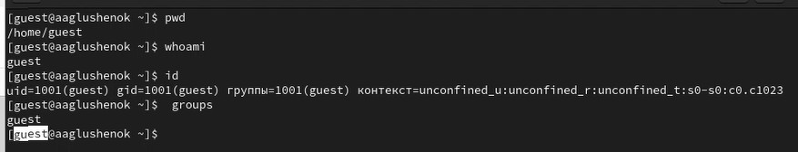
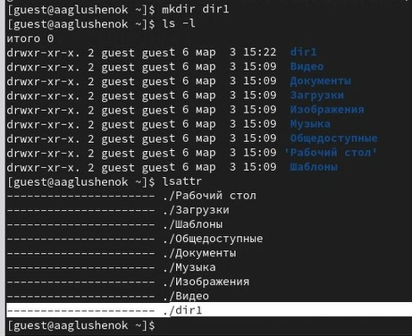

---
## Front matter
title: "Лабораторная работа № 2. Дискреционное разграничение прав в Linux. Основные атрибуты."
subtitle: "Отчет"
author: "Анна Александровна Глушенок"

## Generic options
lang: ru-RU
toc-title: "Содержание"

## Pdf output format
toc: true
toc-depth: 2
lof: true
lot: false
fontsize: 12pt
linestretch: 1.5
papersize: a4
documentclass: scrreprt

## I18n babel
babel-lang: russian
babel-otherlangs: english

## Fonts
mainfont: Liberation Serif
sansfont: Liberation Sans
monofont: Liberation Mono

## Pandoc-crossref LaTeX customization
figureTitle: "Рис."
tableTitle: "Таблица"
lofTitle: "Список иллюстраций"

## Misc options
indent: true
header-includes:
  - \usepackage{indentfirst}
  - \usepackage{float}
  - \floatplacement{figure}{H}
---

# Цель работы

Получение практических навыков работы в консоли с атрибутами файлов, закрепление теоретических основ дискреционного разграничения доступа в современных системах с открытым кодом на базе ОС Linux.

# Выполнение лабораторной работы

1. В ОС создайте учётную запись guest: `useradd guest`.
2. Задайте пароль для guest: `passwd guest`.

{#fig:001 width=80%}

3. Войдите в систему от пользователя guest.

{#fig:002 width=80%}

{#fig:003 width=80%}

4. Определите директорию: `pwd`. Сравните с приглашением командной строки. Является ли она домашней директорией?
5. Уточните имя пользователя командой `whoami`.
6. Уточните имя пользователя, группу, группы куда входит пользователь: `id`. Сравните вывод `id` с `groups`.
7. Сравните информацию об имени пользователя с данными в приглашении командной строки.

{#fig:004 width=80%}

8. Просмотрите файл /etc/passwd: `cat /etc/passwd`. Найдите свою учётную запись, определите uid, gid пользователя. Сравните со значениями в предыдущих пунктах.

{#fig:005 width=80%}

{#fig:006 width=80%}

9. Определите существующие в системе директории: `ls -l /home/`. Удалось ли получить список поддиректорий? Какие права установлены?
10. Проверьте, какие расширенные атрибуты установлены на поддиректориях /home: `lsattr /home`. Удалось ли увидеть атрибуты?

{#fig:007 width=80%}

11. Создайте в домашней директории поддиректорию dir1: `mkdir dir1`. Определите какие права доступа и атрибуты выставлены на директорию: `ls -l` и `lsattr`.

{#fig:008 width=80%}

12. Снимите с директории все атрибуты: `chmod 000 dir1`. Проверьте правильность выполнения: `ls -l`.

{#fig:009 width=80%}

13. Попытайтесь создать в директории dir1 файл file1: `echo "test" > /home/guest/dir1/file1`. Почему отказ в выполнении? Проверьте не находится ли file1 внутри dir1: `ls -l /home/guest/dir1`.

{#fig:010 width=80%}

14. Заполните таблицу «Установленные права и разрешённые действия».

| Права директории | Права файла | Создание файла | Удаление файла | Переименование файла | Смена атрибутов файла | Просмотр файлов в директории | Смена директории | Чтение файла | Запись в файл |
|------------------|-------------|----------------|----------------|----------------------|------------------------|-------------------------------|-------------------|---------------|---------------|
| d(000) | (000) | - | - | - | - | - | - | - | - |
| d--x (100) | (000) | + | - | - | - | - | + | - | - |
| d--x (100) | (700) | + | - | - | + | - | + | + | + |
| d-wx (300) | (000) | + | + | + | - | - | + | - | - |
| d-wx (300) | (700) | + | + | + | + | - | + | + | + |
| dr-x (500) | (000) | - | - | - | - | + | + | - | - |
| dr-x (500) | (700) | - | - | - | + | + | + | + | + |
| drwx (700) | (000) | + | + | + | - | + | + | - | - |
| drwx (700) | (700) | + | + | + | + | + | + | + | + |

15. Заполните таблицу «Минимальные права для совершения операций».

| Операция | Минимальные права на директорию | Минимальные права на файл |
|----------|----------------------------------|---------------------------|
| Создание файла | `-wx` (300) | не требуются |
| Удаление файла | `-wx` (300) | не требуются |
| Переименование файла | `-wx` (300) | не требуются |
| Смена атрибутов файла | `--x` (100) | `rwx` (700) или владение файлом |
| Просмотр файлов в директории | `r-x` (500) | не требуются |
| Смена директории (cd) | `--x` (100) | не требуются |
| Чтение файла | `--x` (100) | `r--` (400) |
| Запись в файл | `--x` (100) | `-w-` (200) |

# Выводы

В ходе выполнения лабораторной работы № 2 мне удалось получить практические навыки работы в консоли с атрибутами файлов, закрепление теоретических основ дискреционного разграничения доступа в современных системах с открытым кодом на базе ОС Linux.
