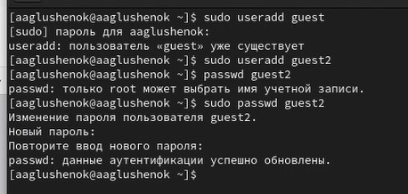
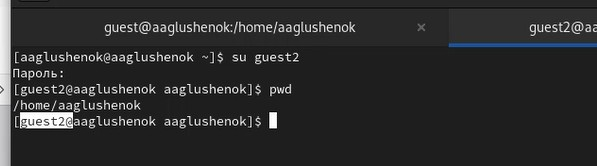

---
## Front matter
lang: ru-RU
title: Лабораторная работа № 3. Дискреционное разграничение прав в Linux. Два пользователя.
subtitle: Презентация
author:
  - Глушенок А. А.
institute:
  - Российский университет дружбы народов, Москва, Россия
date: 13 марта 2026

## Formatting pdf
toc: false
slide_level: 2
aspectratio: 169
section-titles: true
theme: metropolis
header-includes:
 - \metroset{progressbar=frametitle,sectionpage=progressbar,numbering=fraction}
 - \usepackage{graphicx}
 - \usepackage{caption}
 - \captionsetup{labelformat=empty, labelsep=none}
 
## Fonts
mainfont: Liberation Serif
sansfont: PT Sans
monofont: Liberation Mono
---

## Докладчик

:::::::::::::: {.columns align=center}
::: {.column width="70%"}

  * Глушенок Анна Александровна
  * Студент НПИбд-01-24
  * Факультет физико-математических и естественных наук
  * Российский университет дружбы народов
  * [1132246844@pfur.ru](mailto:1132246844@pfur.ru)
  * <https://github.com/aaglushenok>

:::
::: {.column width="30%"}

:::
::::::::::::::

## Цель работы

Получение практических навыков работы в консоли с атрибутами файлов для групп пользователей.

# Выполнение лабораторной работы 

## Задание 1-3

1. Создайте учётную запись guest: useradd guest
2. Задайте пароль для guest: passwd guest
3. Аналогично создайте второго пользователя guest2

{#fig:001 width=40%}

## Задание 4

4. Добавьте пользователя guest2 в группу guest: gpasswd -a guest2 guest

{#fig:002 width=40%}

## Задание 5-6

5. Осуществите вход в систему от двух пользователей на двух разных консолях
6. Для обоих пользователейьопределите директорию, сравните с приглашениями командной строки

{#fig:003 width=40%}

## Задание 5-6

{#fig:004 width=40%}

## Задание 7

7. Уточните имя пользователя, группу, кто входит в неё и к каким группам принадлежит он сам. Определите командами groups guest и groups guest2, в какие группы входят пользователи guest и guest2. Сравните вывод команды groups с id -Gn и id -G

{#fig:005 width=40%}

## Задание 7

{#fig:006 width=40%}

## Задание 7

{#fig:007 width=40%}

## Задание 8

8. Сравните полученную информацию с содержимым файла /etc/group: cat /etc/group

{#fig:008 width=40%}

## Задание 9

9. От имени guest2 выполните регистрацию guest2 в группе guest: newgrp guest

{#fig:009 width=40%}

## Задание 10-11

10. От имени guest измените права директории /home/guest, разрешив все действия: chmod g+rwx /home/guest
11. От имени guest снимите с директории /home/guest/dir1 все атрибуты: chmod 000 dirl и проверьте правильность снятия атрибутов

{#fig:010 width=40%}

## Выводы

В ходе выполнения лабораторной работы № 3 мне удалось получить практические навыки работы в консоли с атрибутами файлов для групп пользователей.
