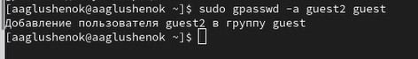
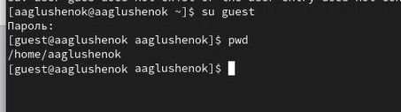
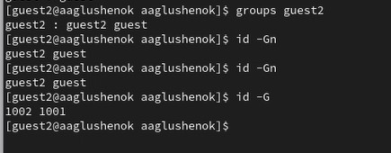
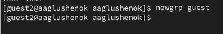

---
## Front matter
title: "Лабораторная работа № 3. Дискреционное разграничение прав в Linux. Два пользователя."
subtitle: "Отчет"
author: "Анна Александровна Глушенок"

## Generic options
lang: ru-RU
toc-title: "Содержание"

## Pdf output format
toc: true
toc-depth: 2
lof: true
lot: false
fontsize: 12pt
linestretch: 1.5
papersize: a4
documentclass: scrreprt

## I18n babel
babel-lang: russian
babel-otherlangs: english

## Fonts
mainfont: Liberation Serif
sansfont: Liberation Sans
monofont: Liberation Mono

## Pandoc-crossref LaTeX customization
figureTitle: "Рис."
tableTitle: "Таблица"
lofTitle: "Список иллюстраций"

## Misc options
indent: true
header-includes:
  - \usepackage{indentfirst}
  - \usepackage{float}
  - \floatplacement{figure}{H}
---

# Цель работы

Получение практических навыков работы в консоли с атрибутами файлов для групп пользователей.

# Выполнение лабораторной работы

1. Создайте учётную запись guest: useradd guest
2. Задайте пароль для guest: passwd guest
3. Аналогично создайте второго пользователя guest2

{#fig:001 width=80%}

4. Добавьте пользователя guest2 в группу guest: gpasswd -a guest2 guest

{#fig:002 width=80%}

5. Осуществите вход в систему от двух пользователей на двух разных консолях
6. Для обоих пользователейьопределите директорию, сравните с приглашениями командной строки

{#fig:003 width=80%}

{#fig:004 width=80%}

7. Уточните имя пользователя, группу, кто входит в неё и к каким группам принадлежит он сам. Определите командами groups guest и groups guest2, в какие группы входят пользователи guest и guest2. Сравните вывод команды groups с id -Gn и id -G

{#fig:005 width=80%}

{#fig:006 width=80%}

{#fig:007 width=80%}

8. Сравните полученную информацию с содержимым файла /etc/group: cat /etc/group

{#fig:008 width=80%}

9. От имени guest2 выполните регистрацию guest2 в группе guest: newgrp guest

{#fig:009 width=80%}

10. От имени guest измените права директории /home/guest, разрешив все действия: chmod g+rwx /home/guest
11. От имени guest снимите с директории /home/guest/dir1 все атрибуты: chmod 000 dirl и проверьте правильность снятия атрибутов

{#fig:010 width=80%}

12. Заполните таблицу 3.1.

| Права директории | Права файла | Просмотр файлов в директории | Смена директории | Создание файла | Удаление файла | Переименование файла | Чтение файла | Запись в файл |
|------------------|-------------|------------------------------|------------------|----------------|----------------|----------------------|--------------|---------------|
| d(000) | f(000) | - | - | - | - | - | - | - |
| d(010) | f(000) | - | + | - | - | - | - | - |
| d(020) | f(000) | - | - | - | - | - | - | - |
| d(030) | f(000) | - | + | - | - | - | - | - |
| d(040) | f(000) | + | - | - | - | - | - | - |
| d(050) | f(000) | + | + | - | - | - | - | - |
| d(060) | f(000) | + | - | - | - | - | - | - |
| d(070) | f(000) | + | + | - | - | - | - | - |
| d(010) | f(040) | - | + | - | - | - | + | - |
| d(010) | f(060) | - | + | - | - | - | + | + |
| d(070) | f(000) | + | + | + | - | - | - | - |
| d(070) | f(040) | + | + | + | - | - | + | - |
| d(077) | f(066) | + | + | + | + | + | + | + |

13. Заполните таблицу 3.2.

| Операция | Минимальные права на директорию | Минимальные права на файл |
|----------|----------------------------------|---------------------------|
| Смена директории (cd) | 010 (--x------) | 000 (---------) |
| Просмотр файлов в директории (ls) | 050 (r-x------) | 000 (---------) |
| Создание файла (touch) | 070 (rwx------) | — |
| Удаление файла (rm) | 070 (rwx------) | 000 (---------) |
| Переименование файла (mv) | 070 (rwx------) | 000 (---------) |
| Чтение файла (cat) | 010 (--x------) | 040 (r--------) |
| Запись в файл (nano/echo) | 010 (--x------) | 060 (rw-------) |

# Выводы

В ходе выполнения лабораторной работы № 3 мне удалось получить практические навыки работы в консоли с атрибутами файлов для групп пользователей.
