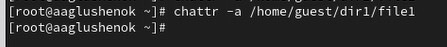
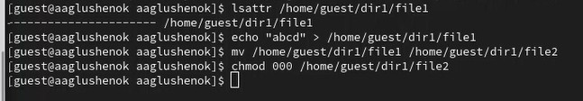

---
## Front matter
lang: ru-RU
title: Лабораторная работа № 4. Дискреционное разграничение прав в Linux. Расширенные атрибуты.
subtitle: Презентация
author:
  - Глушенок А. А.
institute:
  - Российский университет дружбы народов, Москва, Россия
date: N марта 2026

## Formatting pdf
toc: false
slide_level: 2
aspectratio: 169
section-titles: true
theme: metropolis
header-includes:
 - \metroset{progressbar=frametitle,sectionpage=progressbar,numbering=fraction}
 - \usepackage{graphicx}
 - \usepackage{caption}
 - \captionsetup{labelformat=empty, labelsep=none}
 
## Fonts
mainfont: Liberation Serif
sansfont: PT Sans
monofont: Liberation Mono
---

## Докладчик

:::::::::::::: {.columns align=center}
::: {.column width="70%"}

  * Глушенок Анна Александровна
  * Студент НПИбд-01-24
  * Факультет физико-математических и естественных наук
  * Российский университет дружбы народов
  * [1132246844@pfur.ru](mailto:1132246844@pfur.ru)
  * <https://github.com/aaglushenok>

:::
::: {.column width="30%"}

:::
::::::::::::::

## Цель работы

Получение практических навыков работы в консоли с расширенными атрибутами файлов.

# Выполнение работы 

## Задание 1-3

1. От пользователя guest определите расширенные атрибуты file1: lsattr /home/guest/dir1/file1.
2. Установите на file1 права, разрешающие чтение и запись для владельца: chmod 600 file1.
3. Попробуйте установить на file1 расширенный атрибут a от пользователя guest: chattr +a /home/guest/dir1/file1.

{#fig:001 width=40%}

## Задание 4

4. Зайдите на консоль с правами администратора. Попробуйте установить расширенный атрибут a на file1: chattr +a /home/guest/dir1/file1.

{#fig:002 width=40%}

## Задание 5-8

5. От guest проверьте установку атрибута: lsattr /home/guest/dir1/file1.
6. Выполните дозапись в file1 слова «test»: echo "test" /home/guest/dir1/file1. Выполните чтение file1: cat /home/guest/dir1/file1.
7. Попробуйте удалить file1 либо стереть имеющуюся в нём информацию: echo "abcd" > /home/guest/dirl/file1. Попробуйте переименовать файл.
8. Попробуйте установить на file1 права, запрещающие чтение и запись для владельца: chmod 000 file1.
Результат: команда для записи слова test выполняется, остальные команды НЕ выполняются.

{#fig:003 width=50%}

## Задание 9

9. Снимите расширенный атрибут a с file1 от имени суперпользователя: chattr -a /home/guest/dir1/file1. Повторите операции, которые ранее не удавалось выполнить.
Результат: все команды выполняются.

{#fig:004 width=40%}

## Задание 9

{#fig:005 width=50%}

## Задание 10

10. Повторите ваши действия, заменив атрибут «a» атрибутом «i».
Результат: все команды НЕ выполняются.

{#fig:006 width=40%}

## Задание 10

{#fig:007 width=60%}

## Выводы

В ходе выполнения лабораторной работы №4 мне удалось полученить практические навыки работы в консоли с расширенными атрибутами файлов.
