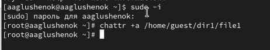
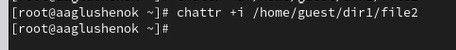

---
## Front matter
title: "Лабораторная работа № 4. Дискреционное разграничение прав в Linux. Расширенные атрибуты."
subtitle: "Отчет"
author: "Анна Александровна Глушенок"

## Generic options
lang: ru-RU
toc-title: "Содержание"

## Pdf output format
toc: true
toc-depth: 2
lof: true
lot: false
fontsize: 12pt
linestretch: 1.5
papersize: a4
documentclass: scrreprt

## I18n babel
babel-lang: russian
babel-otherlangs: english

## Fonts
mainfont: Liberation Serif
sansfont: Liberation Sans
monofont: Liberation Mono

## Pandoc-crossref LaTeX customization
figureTitle: "Рис."
tableTitle: "Таблица"
lofTitle: "Список иллюстраций"

## Misc options
indent: true
header-includes:
  - \usepackage{indentfirst}
  - \usepackage{float}
  - \floatplacement{figure}{H}
---

# Цель работы

Получение практических навыков работы в консоли с расширенными атрибутами файлов.

# Выполнение лабораторной работы

1. От пользователя guest определите расширенные атрибуты file1: lsattr /home/guest/dir1/file1.
2. Установите на file1 права, разрешающие чтение и запись для владельца: chmod 600 file1.
3. Попробуйте установить на file1 расширенный атрибут a от пользователя guest: chattr +a /home/guest/dir1/file1.

{#fig:001 width=80%}

4. Зайдите на консоль с правами администратора. Попробуйте установить расширенный атрибут a на file1: chattr +a /home/guest/dir1/file1.

{#fig:002 width=80%}

5. От пользователя guest проверьте правильность установления атрибута: lsattr /home/guest/dir1/file1.
6. Выполните дозапись в file1 слова «test»: echo "test" /home/guest/dir1/file1. Выполните чтение file1: cat /home/guest/dir1/file1.
7. Попробуйте удалить file1 либо стереть имеющуюся в нём информацию: echo "abcd" > /home/guest/dirl/file1. Попробуйте переименовать файл.
8. Попробуйте установить на file1 права, запрещающие чтение и запись для владельца: chmod 000 file1.
Результат: команда для записи слова test выполняется, остальные команды НЕ выполняются.

{#fig:003 width=80%}

9. Снимите расширенный атрибут a с file1 от имени суперпользователя: chattr -a /home/guest/dir1/file1. Повторите операции, которые ранее не удавалось выполнить.
Результат: все команды выполняются.

{#fig:004 width=80%}

{#fig:005 width=80%}

10. Повторите ваши действия, заменив атрибут «a» атрибутом «i».
Результат: все команды НЕ выполняются.

{#fig:006 width=80%}

{#fig:007 width=80%}

# Выводы

В ходе выполнения лабораторной работы №4 мне удалось полученить практические навыки работы в консоли с расширенными атрибутами файлов.
