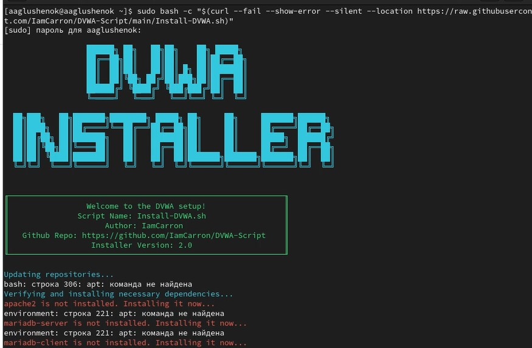
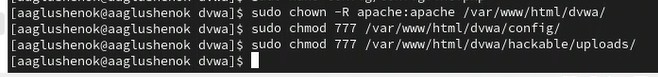
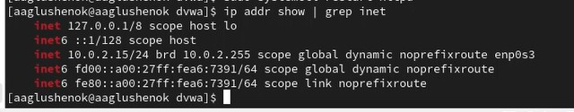
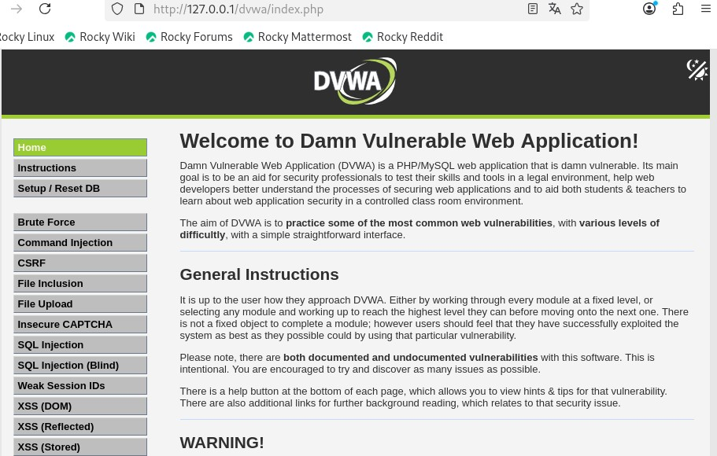

---
## Front matter
lang: ru-RU
title: "Индивидуальный прект. Этап 2: Установка DVWA."
subtitle: Презентация
author:
  - Глушенок А. А.
institute:
  - Российский университет дружбы народов, Москва, Россия
date: 17 марта 2026

## Formatting pdf
toc: false
slide_level: 2
aspectratio: 169
section-titles: true
theme: metropolis
header-includes:
 - \metroset{progressbar=frametitle,sectionpage=progressbar,numbering=fraction}
 - \usepackage{graphicx}
 - \usepackage{caption}
 - \captionsetup{labelformat=empty, labelsep=none}
 
## Fonts
mainfont: Liberation Serif
sansfont: PT Sans
monofont: Liberation Mono
---

## Докладчик

:::::::::::::: {.columns align=center}
::: {.column width="70%"}

  * Глушенок Анна Александровна
  * Студент НПИбд-01-24
  * Факультет физико-математических и естественных наук
  * Российский университет дружбы народов
  * [1132246844@pfur.ru](mailto:1132246844@pfur.ru)
  * <https://github.com/aaglushenok>

:::
::: {.column width="30%"}

:::
::::::::::::::

## Цель работы

Выполнить установку DVWA.

# Выполнение проекта

## Задание 1

1. Переходим в репозиторий на GitHub по ссылке из материалов: https://github.com/digininja/DVWA.

{#fig:001 width=40%}

## Задание 2

2. В файле README.md находим раздел Installstion -> One liner и копируем команду для установки.

{#fig:002 width=40%}

## Задание 3

3. Вставляем скопированную команду в терминал. Получаем ошибку, связанную с использованием apt. Я выполняю индивидуальный проект на Linux Rocky 9 (вместо указанной Linux Kali), из-за чего и возникает ошибка.

{#fig:003 width=40%}

## Задание 4

4. Начинаем выполнять ручную установку DVWA. Выполняем установку необходимых пакетов.

{#fig:004 width=60%}

## Задание 5

5. Осуществляем запуск сервисов.

{#fig:005 width=60%}

## Задание 6

6. Настраиваем БД.

{#fig:006 width=60%}

## Задание 7

7. Скачиваем DVWA.

{#fig:007 width=40%}

## Задание 8

8. Выполняем настройку файла конфигурации (через редактор nano), задаем пароль.

{#fig:008 width=60%}

## Задание 8

{#fig:009 width=40%}

## Задание 9

9. Настраиваем права доступа (даем все разрешения).

{#fig:010 width=40%}

## Задание 10

10. Настраиваем SELinux и Firewall.

{#fig:011 width=40%}

## Задание 11

11. Выводим IP-адрес, добавляем его в ссылку и вставляем ее в браузер.

{#fig:012 width=40%}

## Задание 11

{#fig:013 width=40%}

## Задание 12

12. Входим в систему (логин - admin, пароль - password), и нажимаем на кнопку "create/reset database".

{#fig:014 width=40%}

## Задание 12

{#fig:015 width=40%}

## Выводы

В ходе выполнгения второго этапа индивидуального проекта, мне удалось выполнить установку DVWA.
