---
## Front matter
title: "Индивидуальный прект. Этап 2: Установка DVWA"
subtitle: "Отчет"
author: "Анна Александровна Глушенок"

## Generic options
lang: ru-RU
toc-title: "Содержание"

## Pdf output format
toc: true
toc-depth: 2
lof: true
lot: false
fontsize: 12pt
linestretch: 1.5
papersize: a4
documentclass: scrreprt

## I18n babel
babel-lang: russian
babel-otherlangs: english

## Fonts
mainfont: Liberation Serif
sansfont: Liberation Sans
monofont: Liberation Mono

## Pandoc-crossref LaTeX customization
figureTitle: "Рис."
tableTitle: "Таблица"
lofTitle: "Список иллюстраций"

## Misc options
indent: true
header-includes:
  - \usepackage{indentfirst}
  - \usepackage{float}
  - \floatplacement{figure}{H}
---

# Цель работы

Выполнить установку DVWA.

# Выполнение лабораторной работы

1. Переходим в репозиторий на GitHub по ссылке из материалов: https://github.com/digininja/DVWA.

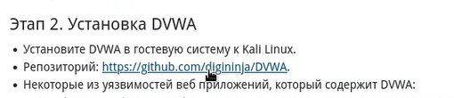{#fig:001 width=80%}

2. В файле README.md находим раздел Installstion -> One liner и копируем команду для установки.

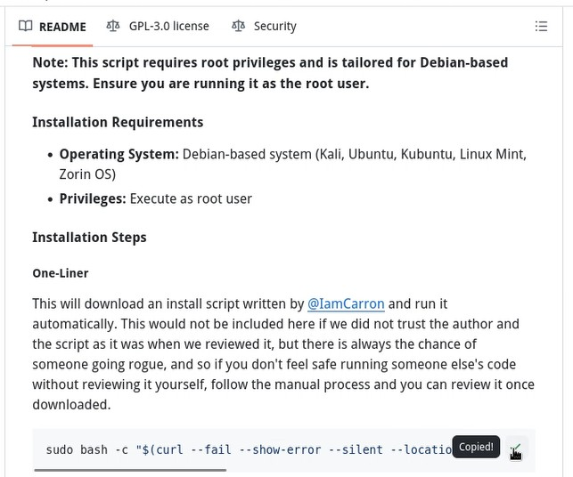{#fig:002 width=80%}

3. Вставляем скопированную команду в терминал. Получаем ошибку, связанную с использованием apt. Я выполняю индивидуальный проект на Linux Rocky 9 (вместо указанной Linux Kali), из-за чего и возникает ошибка.

{#fig:003 width=80%}

4. Начинаем выполнять ручную установку DVWA. Выполняем установку необходимых пакетов.

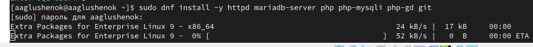{#fig:004 width=80%}

5. Осуществляем запуск сервисов.

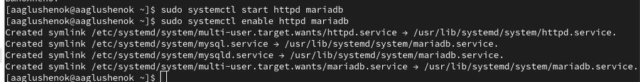{#fig:005 width=80%}

6. Настраиваем БД.

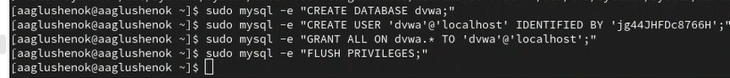{#fig:006 width=80%}

7. Скачиваем DVWA.

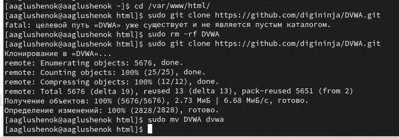{#fig:007 width=80%}

8. Выполняем настройку файла конфигурации (через редактор nano), задаем пароль.

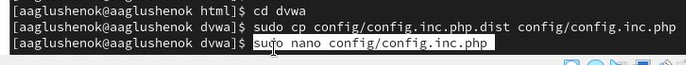{#fig:008 width=80%}

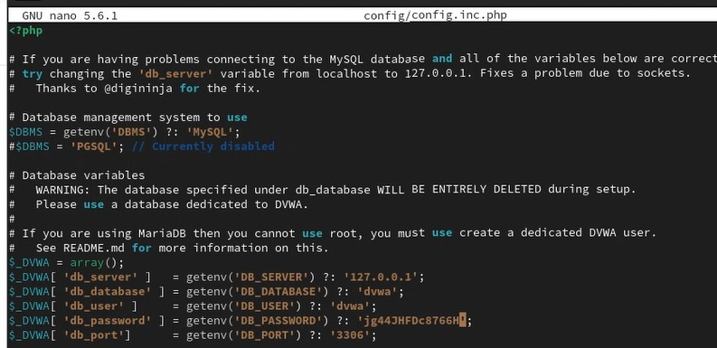{#fig:009 width=80%}

9. Настраиваем права доступа (даем все разрешения).

{#fig:010 width=80%}

10. Настраиваем SELinux и Firewall.

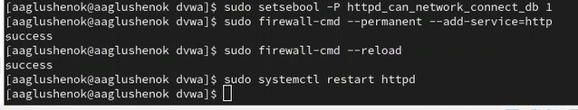{#fig:011 width=80%}

11. Выводим IP-адрес, добавляем его в ссылку и вставляем ее в браузер.

{#fig:012 width=80%}

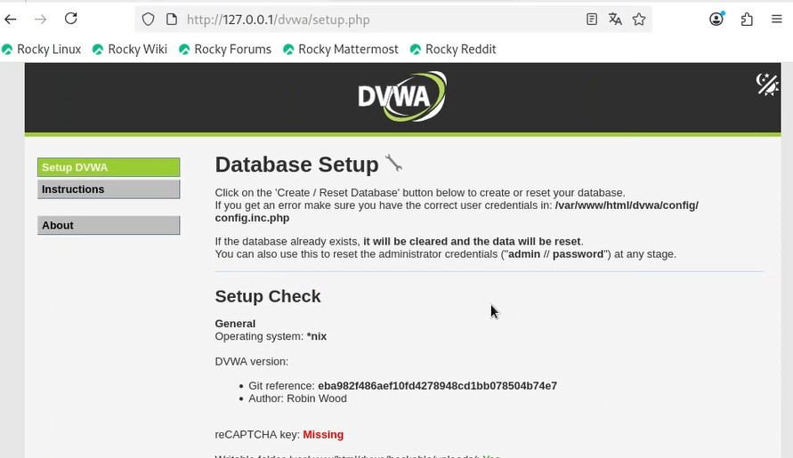{#fig:013 width=80%}

12. Входим в систему (логин - admin, пароль - password), и нажимаем на кнопку "create/reset database".

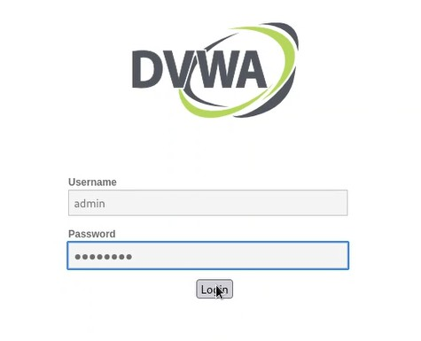{#fig:014 width=80%}

{#fig:015 width=80%}

# Выводы

В ходе выполнгения второго этапа индивидуального проекта, мне удалось выполнить установку DVWA.
