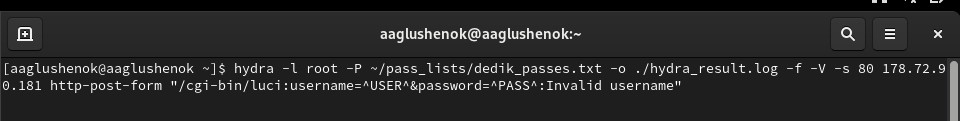
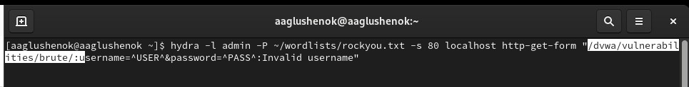
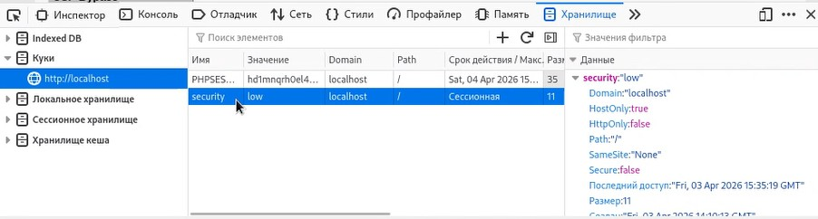
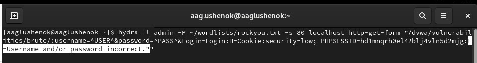

---
## Front matter
lang: ru-RU
title: "Индивидуальный проект. Этап 3. Использование Hydra."
subtitle: Презентация
author:
  - Глушенок А. А.
institute:
  - Российский университет дружбы народов, Москва, Россия
date: 3 апреля 2026

## Formatting pdf
toc: false
slide_level: 2
aspectratio: 169
section-titles: true
theme: metropolis
header-includes:
 - \metroset{progressbar=frametitle,sectionpage=progressbar,numbering=fraction}
 - \usepackage{graphicx}
 - \usepackage{caption}
 - \captionsetup{labelformat=empty, labelsep=none}
 
## Fonts
mainfont: Liberation Serif
sansfont: PT Sans
monofont: Liberation Mono
---

## Докладчик

:::::::::::::: {.columns align=center}
::: {.column width="70%"}

  * Глушенок Анна Александровна
  * Студент НПИбд-01-24
  * Факультет физико-математических и естественных наук
  * Российский университет дружбы народов
  * [1132246844@pfur.ru](mailto:1132246844@pfur.ru)
  * <https://github.com/aaglushenok>

:::
::: {.column width="30%"}

:::
::::::::::::::

## Цель

Осуществить запрос к Hydra, получить существующие пары логин-пароль, войти с помощью них на DWVA Brute Force.

# Выполнение этапа

## Задание 1

1. Копируем в терминал команду для запроса к Hydra (из материалов к выполнению 3 этапа проекта).
 
{#fig:001 width=60%}

## Задание 2

2. Начинаем адаптировать команду под нужные параметры. Меняем логин с root на admin.

{#fig:002 width=60%}

## Задание 3

3. Меняем словарь паролей на тот, который у нас скачан.

{#fig:003 width=60%}

## Задание 4

4. Устанавливаем правильный порт, цель и прописываем метод GET.

{#fig:004 width=60%}

## Задание 5

5. Прописываем полный путь к DWVA Brute Force, с верными параметрами username, password и login.

{#fig:005 width=60%}

## Задание 6

6. Открываем в браузере DWVA, нажимаем ПКМ -> исследовать -> хранилище. Смотрим уровень безопасности (в моем случае low) и копируем идентификатор PHPSESSID.

{#fig:006 width=60%}

## Задание 6

{#fig:007 width=60%}

## Задание 6

{#fig:008 width=60%}

## Задание 7

7. Прописываем в команде уровень безопасности и идентификатор PHPSESSID.

{#fig:009 width=60%}

## Задание 8

8. Прописываем сообщения на случай неудачной попытки входа.

{#fig:010 width=60%}

## Задание 9

9. Запускаем команду. В результате получаем единственную существующую пару логина и пароля (admin, password).

{#fig:011 width=60%}

## Задание 10

10. Вводим полученные логин и пароль на странице DWVA Brute Force, получаем сообщение "добро пожаловать" ("Welcome to rthe password protected area admin").

{#fig:012 width=60%}

# Выводы

В ходе выполнения 3 этапа индивидуального проекта мне удалось осуществить запрос к Hydra, получить существующие пары логин-пароль, войти с помощью них на DWVA Brute Force.
