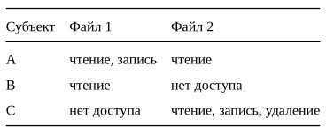
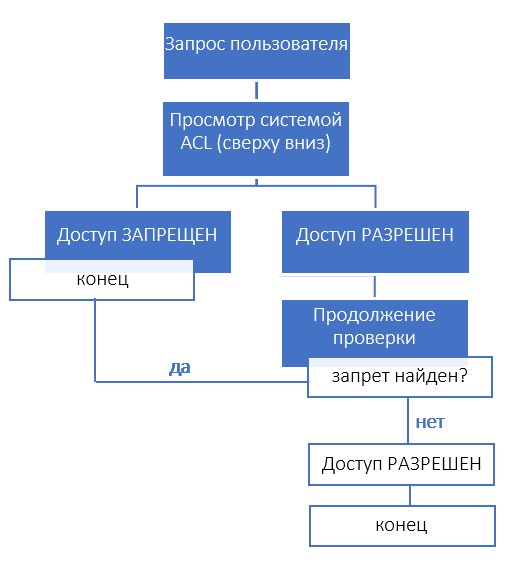
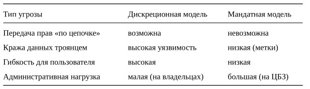
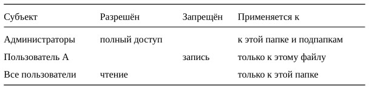
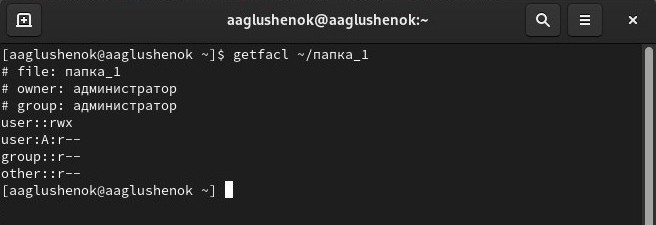

## Докладчик

:::::::::::::: {.columns align=center}
::: {.column width="80%"}

  * Глушенок Анна Александровна
  * Студент НПИбд-01-24
  * Факультет физико-математических и естественных наук
  * Российский университет дружбы народов
  * [1132246844@pfur.ru](mailto:1132246844@pfur.ru)
  * <https://github.com/aaglushenok>

:::
::: {.column width="20%"}

:::
::::::::::::::

# Введение

В современных информационных системах ключевой задачей является защита данных от несанкционированного доступа. Один из старейших и наиболее распространённых подходов к управлению правами пользователей — дискреционные модели. В отличие от жёстких мандатных схем, дискреционный доступ позволяет владельцу ресурса самому решать, кто и как может использовать его файлы, папки или устройства. Основным инструментом реализации такого подхода выступают списки разграничения доступа (классический аналог ACL). В докладе рассматривается устройство этих списков, их сильные и слабые стороны, а также примеры применения.

## Актуальность темы

Дискреционные модели лежат в основе большинства операционных систем общего назначения: Windows, Linux, macOS. Каждый день миллионы пользователей выдают или запрещают доступ к папкам, не задумываясь о теоретических основах. Однако без понимания принципов работы списков доступа невозможно грамотно настроить безопасность в корпоративной сети или даже на домашнем компьютере. Актуальность также связана с ростом угроз утечек данных из-за избыточных прав пользователей.

## Объект и предмет исследования

- *Объект* — дискреционные модели доступа как класс политик информационной безопасности.
- *Предмет* — структура и функционирование списков управления доступом (Access Control Lists), их реализация в виде матрицы прав и связей между субъектами и объектами.

## Научная новизна

Новизна работы заключается не в открытии новых законов, а в систематизации известных подходов применительно к современным гибридным системам (например, совместное использование дискреционных и ролевых моделей). Также рассмотрены типичные уязвимости, возникающие именно из-за неправильной настройки списков доступа.

## Практическая значимость

Материалы доклада могут быть использованы:
- системными администраторами для аудита прав;
- разработчиками приложений, требующих тонкой настройки доступа к ресурсам;
- студентами IT-специальностей при изучении курсов «Безопасность операционных систем» и «Защита информации».

## Материалы, методы и инструменты исследования

- *Материалы:* научные публикации по дискреционному доступу (работы Д. Е. Белла, Л. Дж. Лападулы), документация к файловым системам (NTFS, ext4), стандарты NIST.
- *Методы:* формальное описание модели (множества субъектов, объектов, прав), сравнительный анализ, построение матриц доступа, моделирование угроз.
- *Инструменты:* средства моделирования (таблицы, графы), текстовые редакторы, системные утилиты для просмотра прав в ОС Windows и Linux.

# Цели и задачи

## Цель

Выявить достоинства и недостатки дискреционных моделей доступа на основе списков разграничения доступа, а также предложить рекомендации по их безопасной настройке.

## Гипотеза

Если владелец ресурса использует минимально необходимые права (принцип наименьших привилегий), то дискреционная модель обеспечивает приемлемый уровень защиты в большинстве типовых систем, несмотря на её теоретические уязвимости.

## Задачи исследования

1. Описать формальную модель дискреционного доступа (матрица прав).
2. Разобрать устройство списков управления доступом на примере двух ОС.
3. Выявить основные уязвимости, характерные для дискреционных моделей.
4. Показать, как списки доступа реализуются в файловых системах.
5. Сравнить дискреционный подход с мандатным и ролевым.
6. Сформулировать практические советы по настройке.

# Глава 1. Формальная модель дискреционного доступа и матрица прав

## Множества субъектов, объектов и прав доступа

Дискреционная модель описывается тремя множествами:  
- *S* — субъекты (пользователи, процессы, программы);  
- *O* — объекты (файлы, папки, принтеры, разделы реестра);  
- *R* — права доступа (чтение, запись, выполнение, удаление, смена владельца и др.).

Доступ считается *дискреционным*, потому что владелец объекта может по своему усмотрению передать права другому субъекту. Например, владелец файла разрешает коллеге читать, но не изменять документ.

*Таким образом,* формальное задание через множества позволяет строить таблицы (матрицу доступа) и автоматически проверять, нет ли лишних прав. Это основа для аудита.

## Матрица доступа как способ представления списков

*Матрица доступа* — это таблица, где строки соответствуют субъектам, столбцы — объектам, а на пересечении указаны разрешённые права.

{#fig:001 width=40%}

В строках перечислеы субъекты (пользователи) - A, B, C. В столбцах перечислены объекты (файлы) - файл 1, файл 2. В ячейках перечислены права. Так, например, мы видим, что пользователь A может читать и писать в файл 1, но не может удалять его. Файл 2 пользователь А может только читать, но не может писать в него или удалять.

## Матрица доступа как способ представления списков

На практике такую матрицу хранят не целиком (она была бы огромной), а по столбцам — это и есть *список разграничения доступа* или *ACL*.

*ACL* (Access Control List) или *Список управления доступом*  — это упорядоченный набор записей (правил), который привязывается к каждому объекту (файлу, папке, устройству) и определяет, какие субъекты (пользователи, группы, процессы) и какие именно действия могут выполнять с этим объектом.

Так, для файла "файл 1» ACL будет содержать записи: «А: чтение, запись»; «В: чтение».

*Таким образом,* матрица наглядно показывает, почему дискреционная модель называется «дискреционной» (от слова discretion — усмотрение). Владелец каждого объекта сам заполняет свой столбец.
Матрица прав — удобный теоретический инструмент, но в реальных системах используют именно списки (ACL).

# Глава 2. Устройство списков разграничения доступа и их уязвимости

## Структура списка доступа: запись, идентификатор, маска прав

Каждый список доступа состоит из отдельных записей (*ACE* — Access Control Entry). Одна запись содержит:  
- идентификатор субъекта (например, имя пользователя или группы);  
- набор прав (битовая маска: чтение = 1, запись = 2, выполнение = 4 и т.д.);  
- флаг «разрешить» или «запретить» (запрет обычно имеет приоритет).

При обращении к объекту система последовательно просматривает записи списка. Если находит запись, запрещающую доступ, то доступ блокируется, даже если позже есть разрешающая запись.

## Порядок проверки доступа по списку

{#fig:002 width=45%}

## Порядок проверки доступа по списку

Описание схемы:  
1. Пользователь запрашивает операцию (например, чтение файла).  
2. Система берёт список доступа этого файла.  
3. Идёт по записям сверху вниз.  
4. Если найдена запись с явным ЗАПРЕТОМ для этого пользователя или его группы — доступ НЕ РАЗРЕШЁН (конец).  
5. Если найдена запись с РАЗРЕШЕНИЕМ — доступ РАЗРЕШЁН (но проверка продолжается до конца на случай запрета).  
6. Если подходящих записей нет — доступ ЗАПРЕЩЁН по умолчанию.

*Таким образом,* такая структура делает списки гибкими: можно дать доступ всем сотрудникам отдела, но запретить конкретному стажёру. Однако порядок записей критичен.
Список доступа — это упорядоченный набор правил, обрабатываемый по приоритету «запрет сильнее разрешения».

## Типичные уязвимости дискреционных моделей и списков

Выявлены три основные проблемы:  
1. *Наследование прав.* Создавая новый файл в папке, он часто получает права папки. Пользователь может и не знать, что унаследовал лишние права.  
2. *Отсутствие глобального контроля.* Владелец файла может дать доступ кому угодно. Администратор не может легко запретить это (в отличие от мандатной модели).  
3. *Троянские программы.* Если вредоносная программа запущена от имени пользователя, она получает все его права и может украсть или уничтожить файлы, к которым у пользователя есть доступ.

## Сравнение угроз для дискреционной и мандатной моделей

{#fig:003 width=58%}

Так, мы видим, что дискреционная модель проста в администрировании, но уязвима к краже данных или утечке прав. А мандатная модель сложна в администрировании, но устойчива к краже данных или утечке прав.

*Таким образом,* понимание уязвимостей позволяет грамотно применять списки доступа там, где они эффективны, и не использовать их для особо секретных данных.
Слабость дискреционной модели — в её гибкости, которую можно обернуть против системы.

# Глава 3. Практическое применение и сравнение с другими моделями

## Реализация списков доступа в файловых системах (NTFS, ext4)

В *Windows* каждый объект содержит список доступа. Можно посмотреть права через свойства файла → «Безопасность». Записи бывают для пользователей и групп (например, «Администраторы», «Все»).  
В *Linux* классические права (rwx) — это упрощённый вариант. Для расширенных списков используются механизмы ACL (команды setfacl, getfacl).

Например, для того тобы дать пользователю «А» право читать папку «папка 1», но НЕ менять её, в Windows достаточно добавить запись А — чтение». При этом владельцем папки остаётся администратор. А в операционной системе Linux для таких же гибких списков придется использовать расширенные механизмы (команды setfacl и getfacl), которые позволяют задавать права для любого пользователя, а не только для владельца.

## Список доступа к файлу в Windows

{#fig:004 width=90%}

## Список доступа к файлу в Linux

{#fig:005 width=60%}

*Таким образом,* готовая реализация в популярных ОС доказывает, что списки доступа — рабочий, отлаженный механизм. При этом администратору не нужно изучать сложные теории.
Списки доступа интуитивно понятны, что снижает порог входа для настройки безопасности.

## Сравнительный анализ: дискреционная, мандатная и ролевая модели

- *Дискреционная:* владелец решает. Плюсы — гибкость, минусы — риск утечек.  
- *Мандатная:* система на основе меток (секретности). Плюсы — высокая защита от троянов, минусы — сложность, невозможность для обычного пользователя менять права.  
- *Ролевая (RBAC):* права назначаются ролям (бухгалтер, менеджер), а пользователи получают роли. Это компромисс. В чистом виде ролевая модель часто дополняется дискреционными списками для исключений.

## Сравнение моделей по сложности администрирования и уровню безопасности

{#fig:006 width=75%}

Так, мы наглядно видим, что чем выше уровень безопасности модели, тем сложнее ее администрирование.

*Таким образом,* ни одна модель не идеальна. На практике в корпоративной сети используют ролевую модель для массового назначения прав и дискреционные списки для индивидуальных прав (например, доступ начальника к личной папке подчинённого).
Выбор модели зависит от требований. Для домашнего ПК достаточно дискреционных списков. Для военной системы нужна мандатная.

# Заключение и выводы

## Заключение и выводы

1. *Выполнены все поставленные задачи:*
- Описана формальная модель дискреционного доступа через множества субъектов, объектов и матрицу прав. Показано, что списки разграничения доступа — это столбцы матрицы.
- Разобрано устройство списка доступа: записи, идентификаторы, маски прав, приоритет запрета. Схема проверки доступа демонстрирует алгоритм работы.
- Выявлены основные уязвимости: наследование прав, передача прав «по цепочке», уязвимость перед троянскими программами. Составлена таблица сравнения угроз.
- На примере NTFS и ext4 показана практическая реализация списков в файловых системах, описано графическое представление прав.
- Проведён сравнительный анализ трёх моделей доступа (дискреционная, мандатная, ролевая) с построением графика их сложности и безопасности.

## Заключение и выводы

2. *Сформулированы практические советы:*
- Не использовать учётную запись администратора для повседневной работы.
- Регулярно проверять списки доступа на предмет лишних записей.
- Для важных данных применять принцип наименьших привилегий.
- В корпоративной среде сочетать ролевую модель с дискреционными списками.

3. *Сделан основной вывод:* Дискреционные модели доступа и списки управления доступом остаются фундаментом систем общего назначения благодаря простоте и гибкости. Однако их безопасность напрямую зависит от культуры пользователей и регулярного аудита. Гипотеза подтвердилась: при соблюдении принципа наименьших привилегий дискреционная модель даёт приемлемый уровень защиты.
